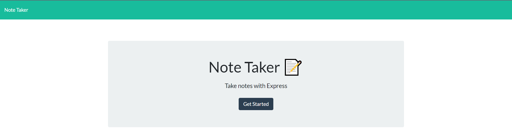
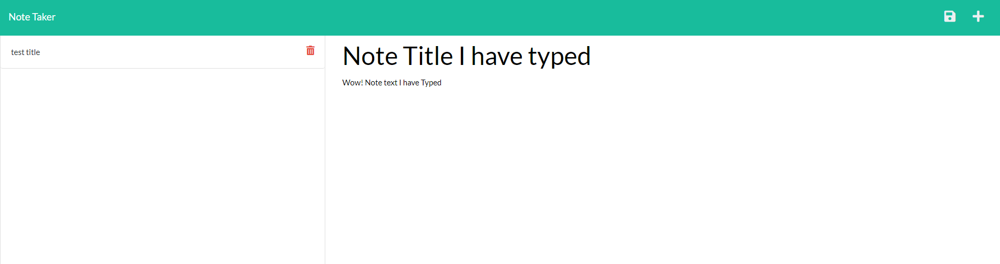

# note-taker

For this project I built the backend to a note taker website. The HTML, CSS, and index.js were all provided. I was just to create the backend with express.js and deploy it on heroku.





## Tools used

I used Node.js, npm, and express.js to build the back end.

## Routes

I first built the routes that were going to be used. 

One for the home page.

```javascript
// GET Route for homepage
app.get('/', (req, res) =>
  res.sendFile(path.join(__dirname, '/public/index.html'))
);
```

Another for the note taking page.

```javascript
// GET Route for notes
app.get('/notes', (req, res) =>
  res.sendFile(path.join(__dirname, '/public/notes.html'))
);
```

I also made a route to get notes saved to the database.

```javascript
// GET Route for api/notes
app.get('/api/notes', (req, res) =>
  res.sendFile(path.join(__dirname, '/db/db.json'))
);
```
Then I built the one to add to the database.

```javascript
// POST Route for submitting notes
app.post('/api/notes', (req, res) => {
    // Log that a POST request was received
    console.info(`${req.method} request received to submit note`);

    // Destructuring assignment for the items in req.body
    const { title, text } = req.body;
  
    // If all the required properties are present
    if (title && text) {
      // Variable for the object we will save
      const newNote = {
        title,
        text,
        note_id: uniqid(),
      };
  
      readAndAppend(newNote, './db/db.json');
  
      const response = {
        status: 'success',
        body: newNote,
      };
  
      res.json(response);
    } else {
      res.json('Error in posting note');
    }
  });
  ```